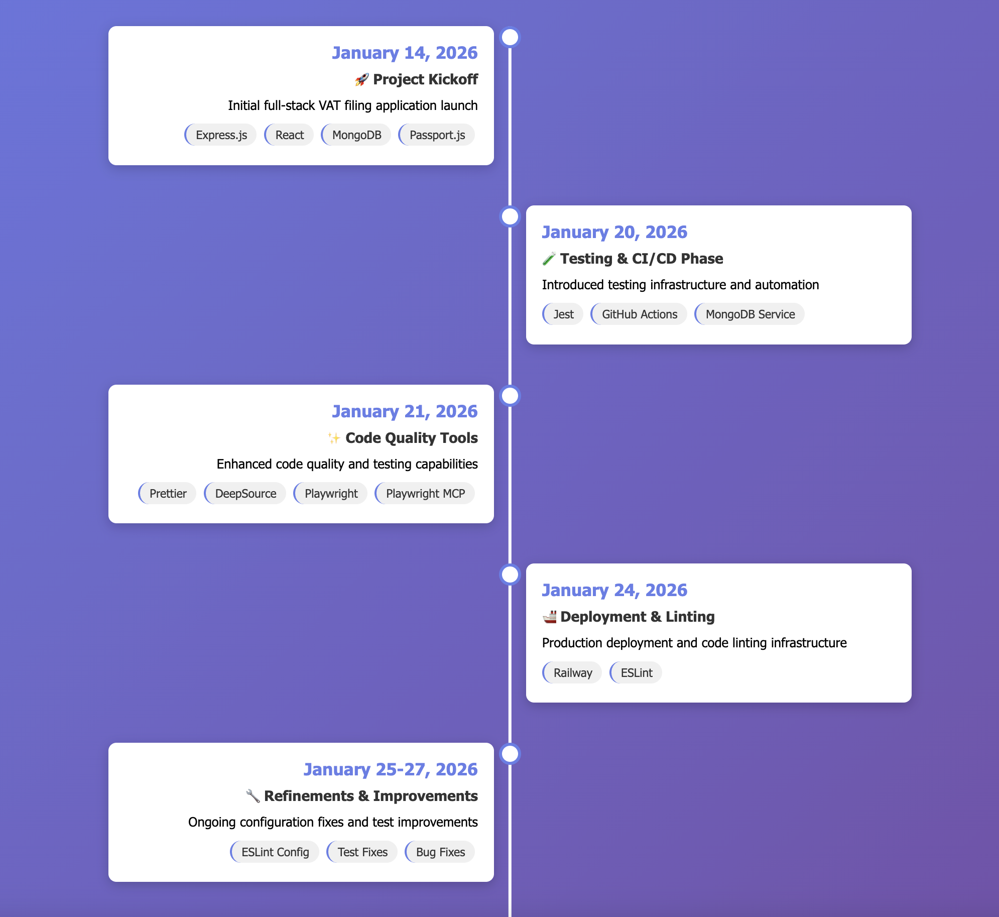

# Timeline Generation Instructions

This document defines the requirements and specifications for generating Feature and Tooling timelines from git history.

---

## Tooling Timeline Requirements

Use this image for inspiration 

### Output Format

Each timeline card should contain:
- **Date**: Formatted as "January 14, 2026"
- **Icon**: Emoji representing the phase title. Pick an appropriate one based on nature of changes. 
- **Phase Title**:
  - A very short summary of what the libraries provide. 
  - If there are more than one category of libraries, you may provide a joint title compromising at max 3 categories. For example, "Frontend, Backend & Database Setup", or "Testing & CI/CD Phase" or "Deployment & Linting". If its change of only one type, you can add just one title say "Code Quality Tools"
  - (For reference, see image above). 
- **Description**: A little longer (7 to 10 words ) to elaborate a bit on the phase title. (For reference, see image above).  
- **Tags**: Individual tools/libraries "newly" introduced on that day in a pill-shaped badges. 

### Data Sources for **Tags**

1. **Primary Source: `package.json`**
   - Parse git diffs to detect "when" dependencies were added
   - Track both `dependencies` and `devDependencies`
   - Extract tool/library names and show them on card if introduced for the first time. 
   - If tool/library was already introduced earlier in timeline, and if we are only updating the version, ignore showing them on the card. 

2. **Secondary Sources (for non-npm tooling):**
   - Look into other tooling type and show them on card if introduced for the first time. Ignore if already introduced before. 

### Grouping Rules for Date

1. **Group by Date**: All tools introduced on the same day appear in ONE card
2. **Never show individual tool cards** - always group on date. 
3. **Give date range if no significant changes were introduced between dates** - If too little changes are introduced between a date range, you can give a date range such as January 25-27, 2026 to show what changes were introduced. 

### ⚠️ IMPORTANT: Ignore Commit Messages

**DO NOT rely on commit messages** to determine what libraries/tools were introduced.

Commit messages can be:
- Vague ("adding test library", "updated code")
- Misleading ("added formatting" when actually doing linting)
- Incomplete (doesn't mention all changes)
- Lying (says one thing, does another)

---

